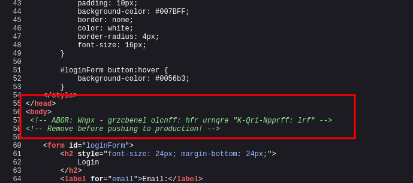
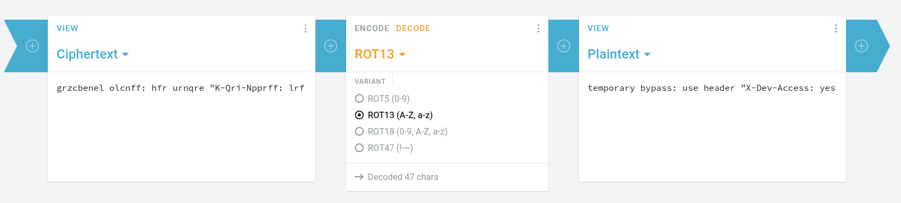
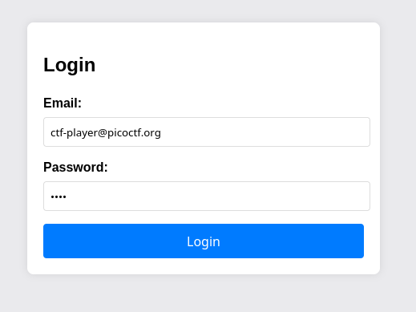
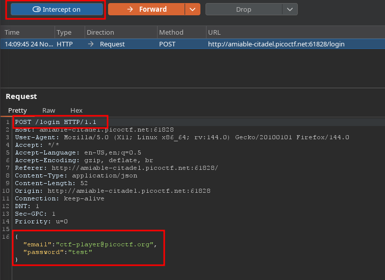
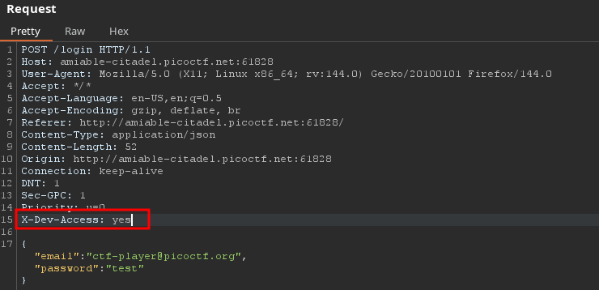

# [CTF Name] - Crack The Gate 1

**Category:** Web Exploitation  
**Points:** [Points]  
**Difficulty:** Easy  
**Author:** Yahaya Meddy  
**Files:** NA

## Challenge Description

> We’re in the middle of an investigation. One of our persons of interest, ctf player, is believed to be hiding sensitive data inside a restricted web portal. We’ve uncovered the email address he uses to log in: ctf-player@picoctf.org. Unfortunately, we don’t know the password, and the usual guessing techniques haven’t worked. But something feels off... it’s almost like the developer left a secret way in. Can you figure it out?

## Initial Analysis

### What we know:

- Emmail: ctf-player@picoctf.org

### Tools Used:

- [Burp Suit] - Capture and intercept Requests

## Reconnaissance
Inital Assesment reveals a ROT13 cipher in the code, decoding it reveales a note to bypass the login for dev

### Step 1: Initial Inspection

1. Source code inspection revealed a ROT 13 cipher

2. Decoding the cihper via online tools

3. We will use a special header in the request to bypass the login screen. Capture the login request by supplying the given email and any password.

4. Add the X-Dev: yes header as shown below

5. Forward the request and you wil have your flag
