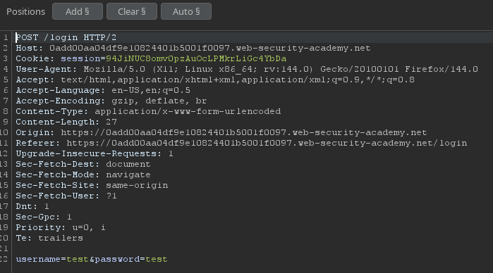
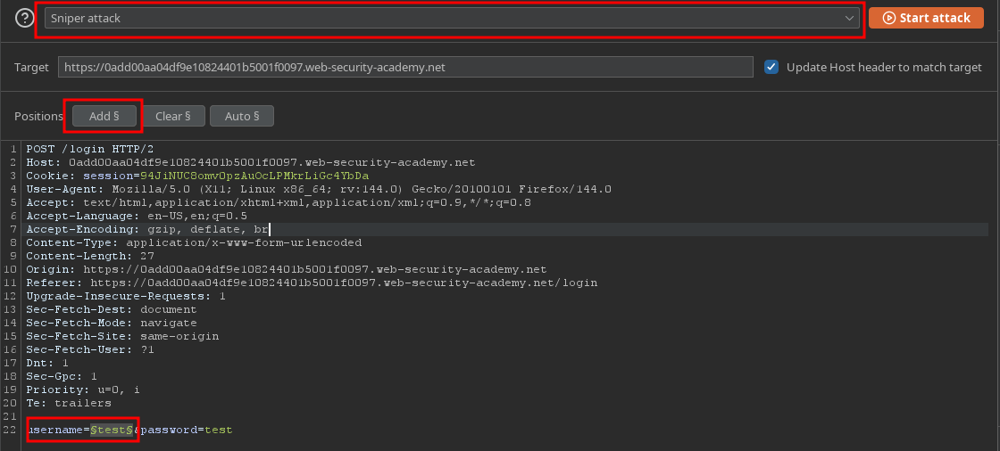
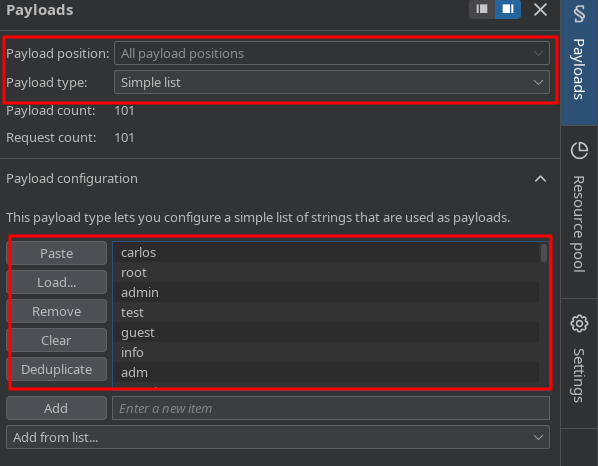
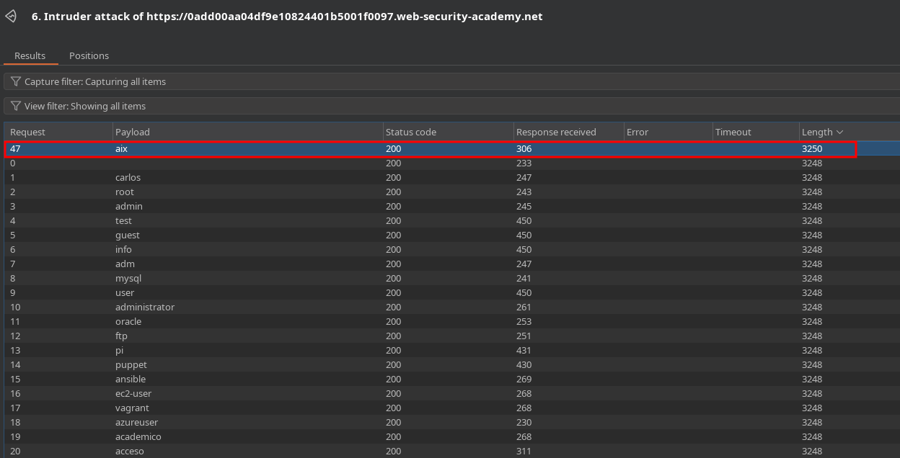
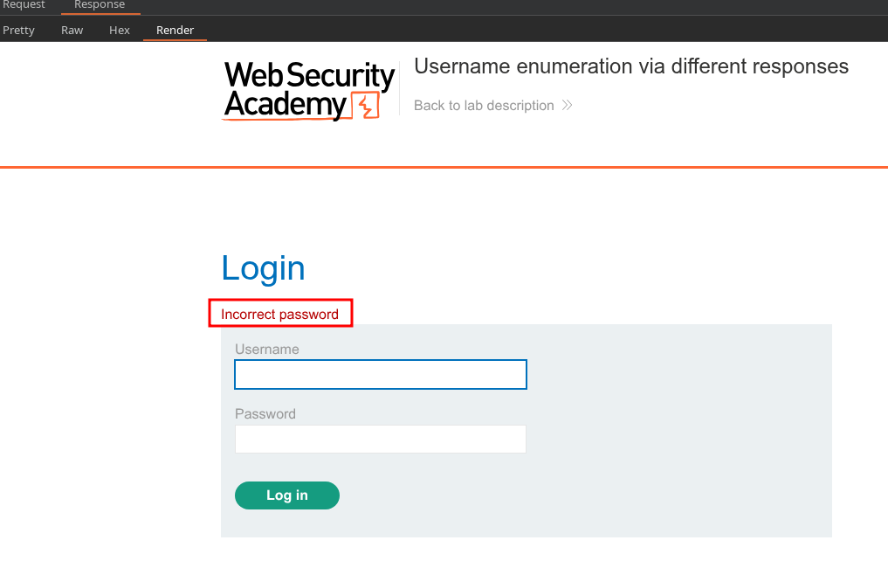
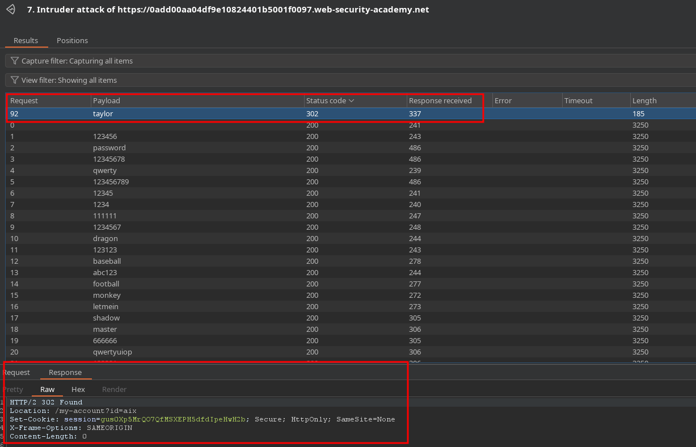

# PortSwigger Lab Writeup: Username enumeration via different responses

## Lab Details
- **Lab URL:** [Username enumeration via different responses](https://portswigger.net/web-security/learning-paths/authentication-vulnerabilities/password-based-vulnerabilities/authentication/password-based/lab-username-enumeration-via-different-responses)
- **Lab Category:** Authentication Vulnerabilities
- **Lab Title:** Username enumeration via different responses
- **Difficulty Level:** Apprentice
- **Lab Objective:** This lab is vulnerable to username enumeration and password brute-force attacks. It has an account with a predictable username and password

## Executive Summary
Lab login endpoint was vulnerable to brute-force attacks as the succesive incorrect attempts were not blocked. Therefore, to exploit we used burp-suite sniper attack to enumerate credentials based on different responses

## Methodology

### 1. Reconnaissance
- Login page has no brute-force protection as successive incorrect attempts were not blocked
- Application returned different response for correct username
- Tools used: Burp Suite

### 2. Vulnerability Identification
- **Vulnerability Type:** Broken Authentication
- **Location:** /login endpoint
- **Trigger:** Using sniper attack, brute-force userame and check response, a 302 reponse means correct response

### 3. Exploitation
#### Step-by-Step Process:
1. Capture the login request and send it to burp Intruder

2. Once the request is in intruder, select Sniper Attack as attack type and set payload position at username by selecting the username value and clicking add$.

3. Use the username list from the website and paste them in the payload configuration section

4. Start the attack and sort the table using the length column, you will notice that only one response will return a different legnth and upon looking at the response the error is *incorrect password* which means that username is correct (aix). Note the Username

5. Repeate the steps for password, change usernamt to one found in step 4 and set payload to position to password as done for usename in step 3. Make sure to clear and replace payload configuration list with passwords from the website. Start the atatck and sort the status code column 302 code confirms the login, check response and use the credentials to login to solve the lab.

...

### 4. Proof of Concept

