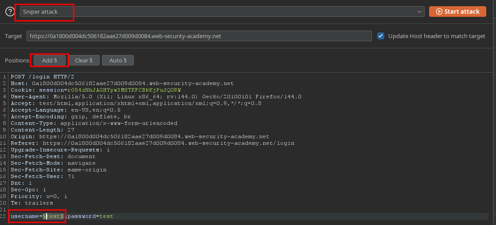
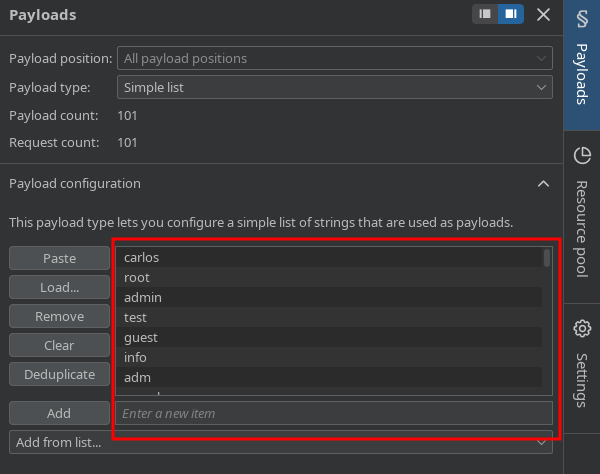
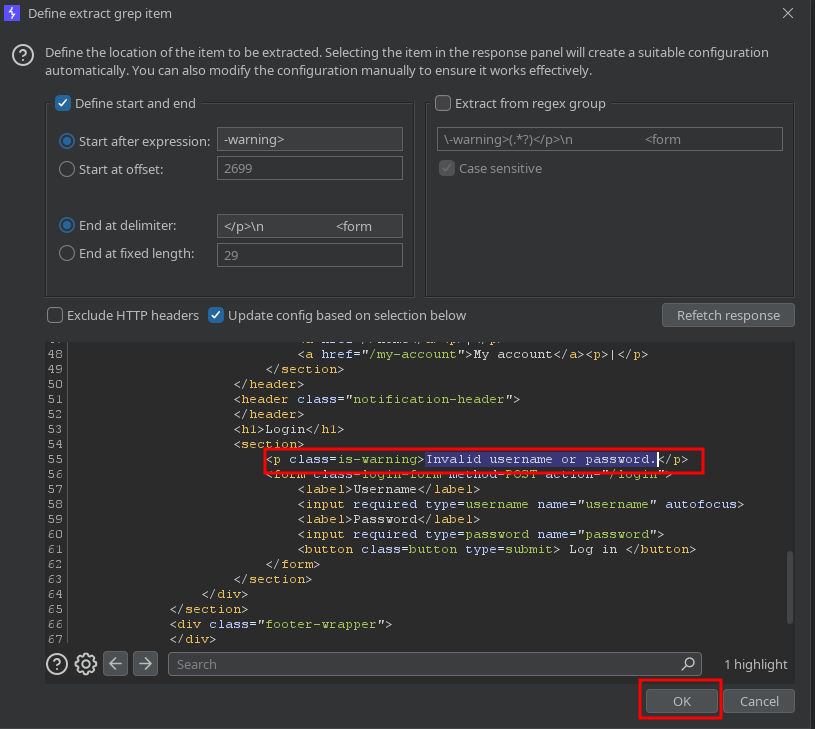
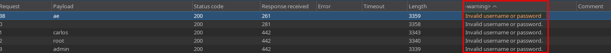
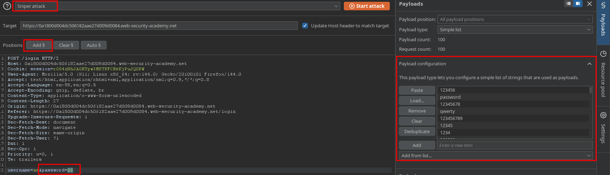
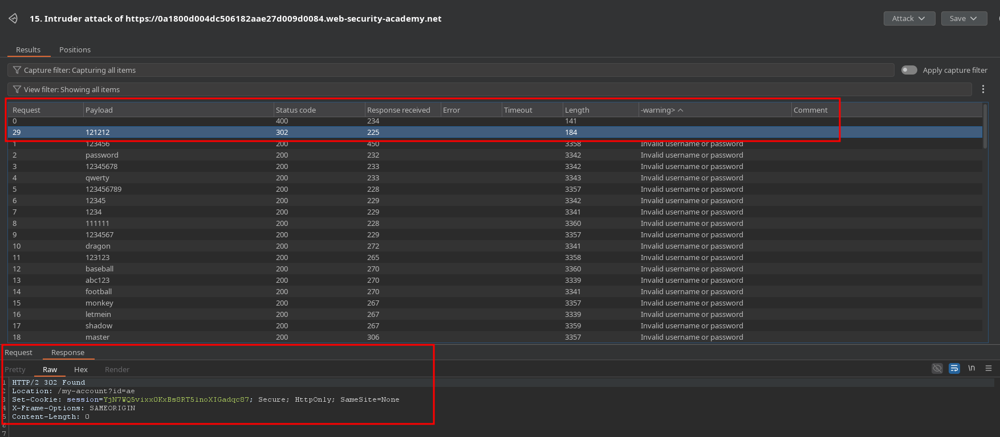
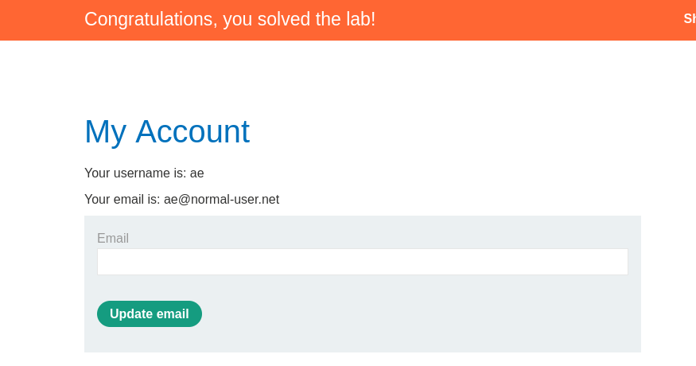

# PortSwigger Lab Writeup: Username enumeration via subtly different responses

## Lab Details
- **Lab URL:** [Username Enum w/d Different response](https://portswigger.net/web-security/learning-paths/authentication-vulnerabilities/password-based-vulnerabilities/authentication/password-based/lab-username-enumeration-via-subtly-different-responses)
- **Lab Category:** Authentication Vulnerabilities
- **Lab Title:** Username enumeration via subtly different responses
- **Difficulty Level:** Practitioner
- **Lab Objective:** This lab is subtly vulnerable to username enumeration and password brute-force attacks. It has an account with a predictable username and password

## Executive Summary
Lab login endpoint was vulnerable to brute-force attacks as the succesive incorrect attempts were not blocked. Therefore, to exploit we used burp-suite sniper attack to enumerate credentials based on nulll error response

## Methodology

### 1. Reconnaissance
- Login page has no brute-force protection as successive incorrect attempts were not blocked
- Application returned no error response for correct username
- Tools used: Burp Suite

### 2. Vulnerability Identification
- **Vulnerability Type:** Broken Authentication
- **Location:** Login page
- **Trigger:** Brute-Force the login page wil credentials

### 3. Exploitation
#### Step-by-Step Process:
1. Intercept the Login request and send it to intruder. Set the payload position to username field

2. Add the username list in the payload configuration

3. For this we will modify and cature the error response. Wihtin the payload configuration, go to settings tab and use the grep extract option to extract error message from the response, highlight the error message and click add as shown below

4. Start the attack and wait for  response in the warning column. You will notice that there is one respnse in the warning column which is slightley different for the rest. The error contains a trailing space rather than the full-stop at the end, take note of the username.

5. Repeate all the steps but set the payload position to password and user the identified username as username, make sure to replace the payload configuration list from username to passwords. Start attack and the response with no error is the password. You can verify it from the response tab

### 4. Proof of Concept

