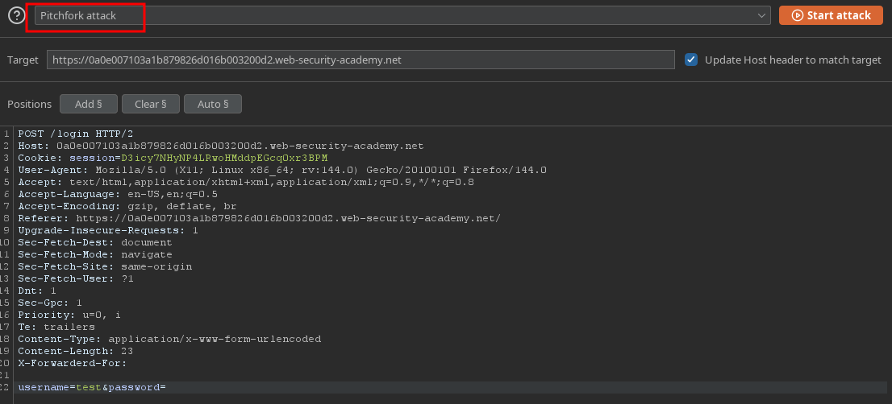
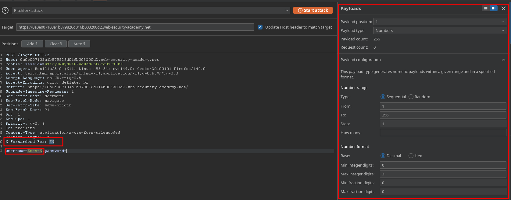
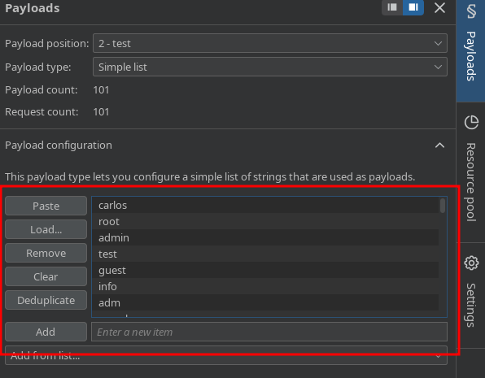
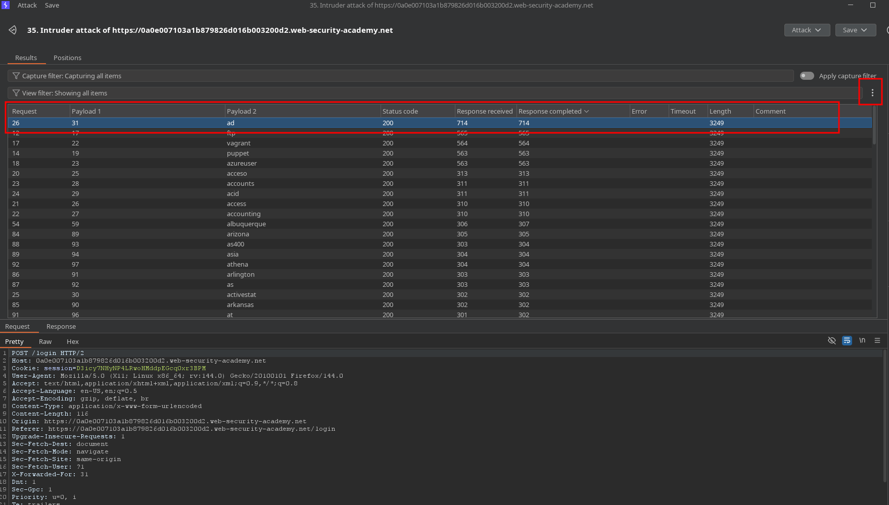
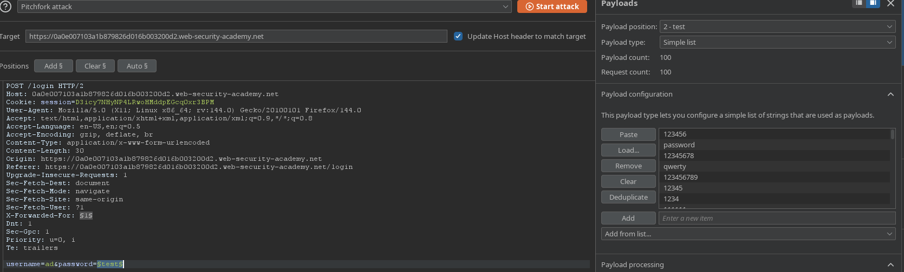
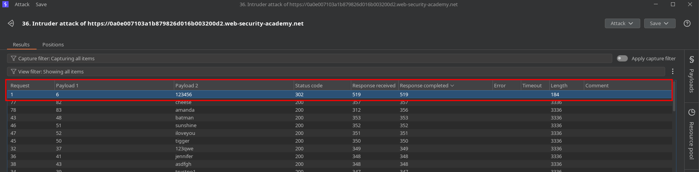
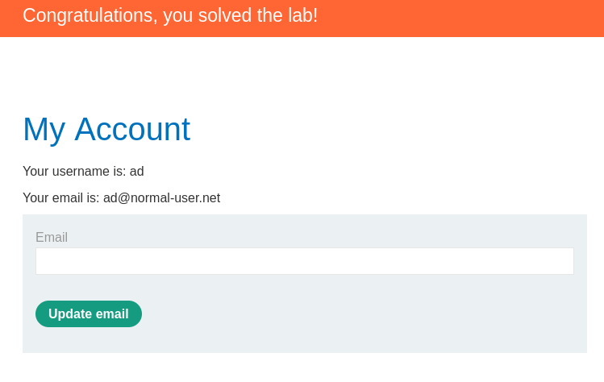

# PortSwigger Lab Writeup: Username enumeration via response timing

## Lab Details
- **Lab URL:** [Username Enum w/d response timings](https://portswigger.net/web-security/learning-paths/authentication-vulnerabilities/password-based-vulnerabilities/authentication/password-based/lab-username-enumeration-via-response-timing)
- **Lab Category:** Authentication Vulnerabilities
- **Lab Title:** Username enumeration via response timing
- **Difficulty Level:** Practitioner
- **Lab Objective:** This lab is vulnerable to username enumeration using its response times. To solve the lab, enumerate a valid username, brute-force this user's password, then access their account page. To add to the challenge, the lab also implements a form of IP-based brute-force protection. However, this can be easily bypassed by manipulating HTTP request headers.

## Executive Summary
As there is IP restriction which tells us that X-Forwarded-For is supported, so we use pitch-fork attack to spoof IP and another payload parameter for username. After attack is completed, we add a response completed column, the time which takes longest is the username. Make sure to keep password length more than 100 and then start attack. Repeat the same for password

## Methodology

### 1. Reconnaissance
- Login page has brute-force protection as successive incorrect attempts were blocked
- Application returned different response timings for correct credentials
- Tools used: Burp Suite

### 2. Vulnerability Identification
- **Vulnerability Type:** Broken Authentication
- **Location:** Login page
- **Trigger:** Brute-Force the login page with credentials

### 3. Exploitation
#### Step-by-Step Process:

1. Intercept the Login request and send it to intruder. Set the attack type to pitch-fork and add the X-Forwarded-for header to bypass IP restrictions

2. For Payload configration, payload position 1  should be numbers from 1 to 256 to bypass IP restrictions and 2nd will be username, set he positions and payloads as shown below

3. Start the attack and once completed add the response completed column to the results list, check the response. One of them would be significantaly larger, take note of the username 

4. Repeat all the steps but set the payload position 2 to password and user the identified username as username, make sure to replace the payload configuration list from username to passwords. Start attack and the response with no error is the password. You can verify it from the response tab

### 4. Proof of Concept

