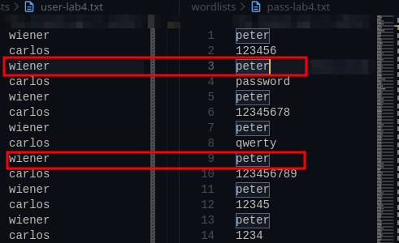
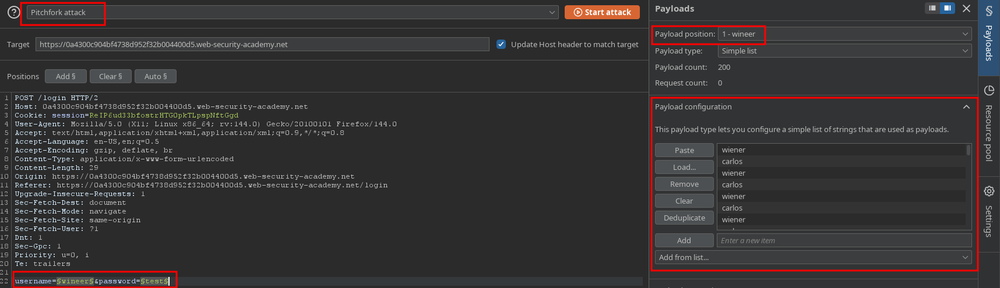
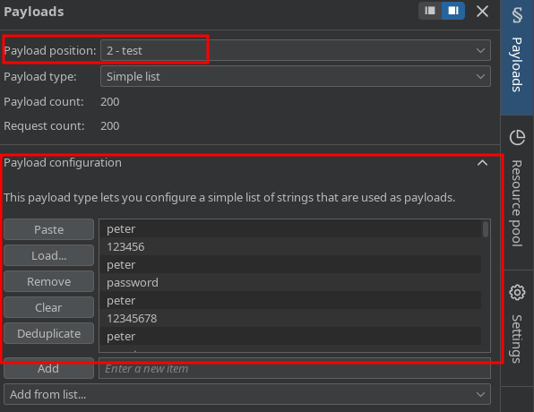
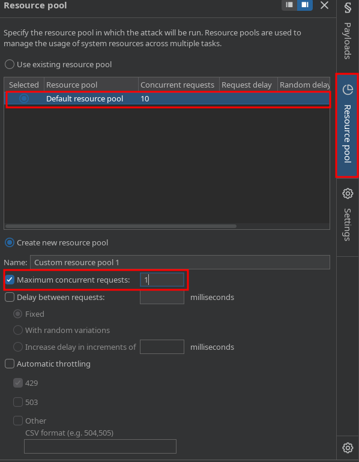
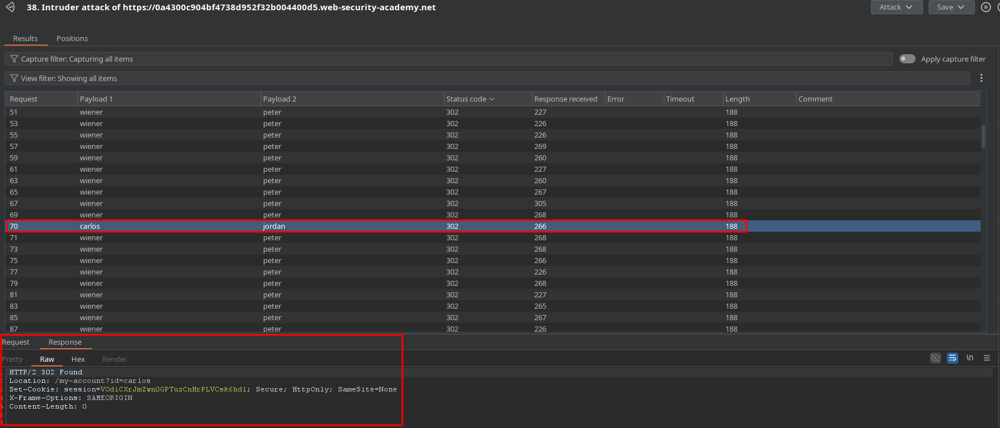
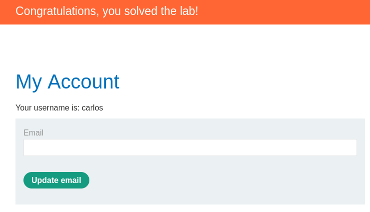

# PortSwigger Lab Writeup: Broken brute-force protection, IP block

## Lab Details
- **Lab URL:** [Broken brute-force protection, IP block](https://portswigger.net/web-security/learning-paths/authentication-vulnerabilities/password-based-vulnerabilities/authentication/password-based/lab-broken-bruteforce-protection-ip-block)
- **Lab Category:** Authentication Vulnerabilities
- **Lab Title:** Broken brute-force protection, IP block
- **Difficulty Level:** Practitioner
- **Lab Objective:** This lab is vulnerable due to a logic flaw in its password brute-force protection. To solve the lab, brute-force the victim's password, then log in and access their account page.

## Executive Summary

Due to IP block we were unable to run the brute-force method as the ip was blocked after certain amount of requests, but there was a catch, once we entered the correct credentials the restriction was removed and the counter was reset. So the approach was to modify the username and password file in such a way that it alternately used the correct credential so that the requests are not blocked. Provided correct credential are *wiener:peter* and victim username is *carlos*

## Methodology

### 1. Reconnaissance

- Login page has brute-force protection as successive incorrect attempts were blocked
- But once correct credential were supplied, the restrictionwas lifted and counter was lifted
- Application returned different response timings for correct credentials
- Tools used: Burp Suite

### 2. Vulnerability Identification

- **Vulnerability Type:** Broken Authentication
- **Location:** Login page
- **Trigger:** Bypass the IP Block restriction on login page with correct credentials

### 3. Exploitation

#### Step-by-Step Process:

1. For the attack we need to prepare a separate username and password file, the idea is that once correct credentials are provided the block counter is reset, so we will add correct username and correct password in the wordlist. Make sure to keep the username and password consistent and infornt of each other.

2. For Payload configration, payload position 1  should be username and payload set will be username file (file in wordlist folder) and position 2 will be password and pass4 file from wordlist folder 

3. As there is IP restriction we would set the max concurent request to 1 from the resource pool setting

4. Start the attack and once the attack is completed look at the status code column, status code with 302 is the username and password. You can verify it from the response tab as well

### 4. Proof of Concept

