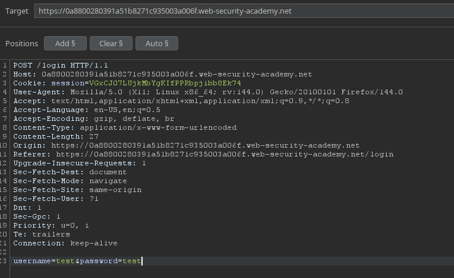
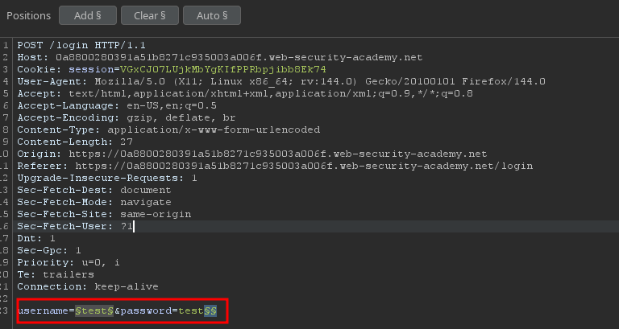
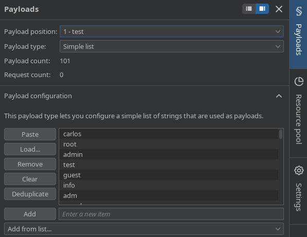
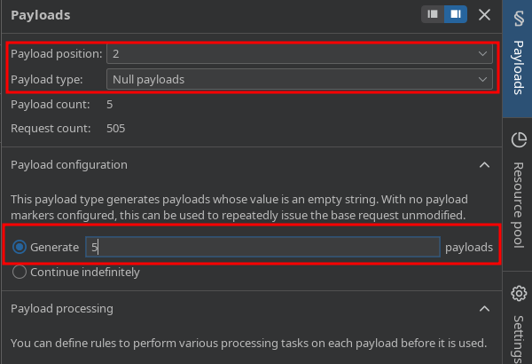
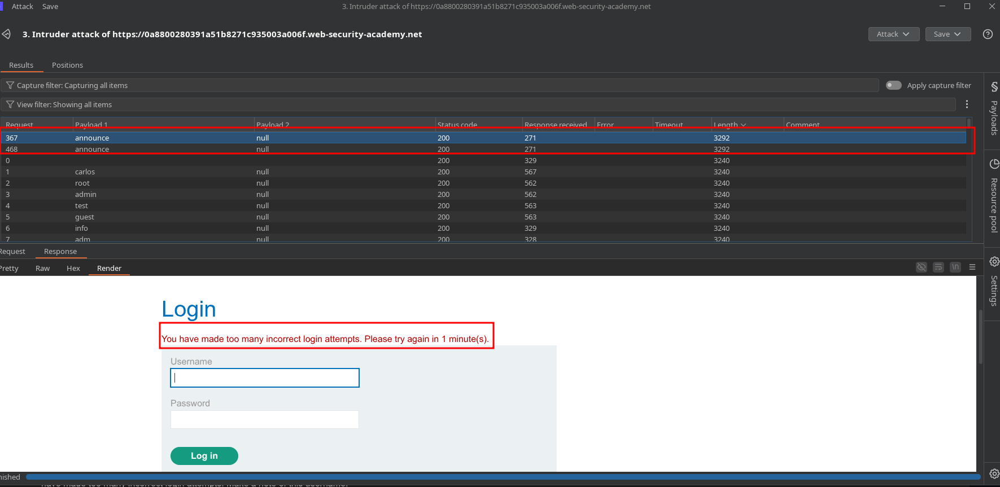
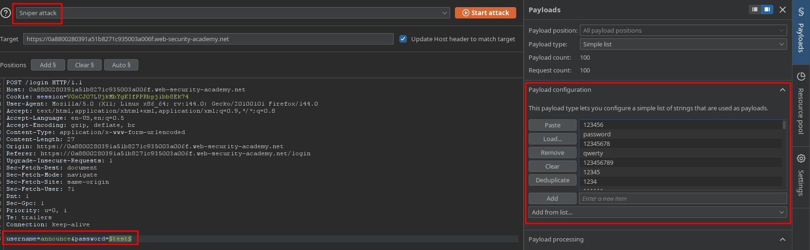
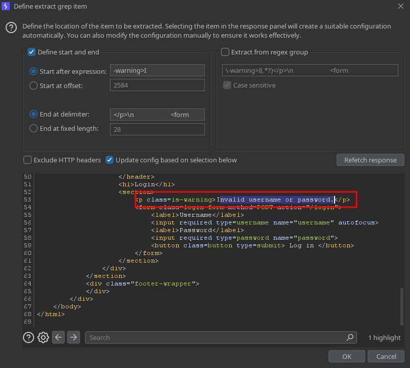
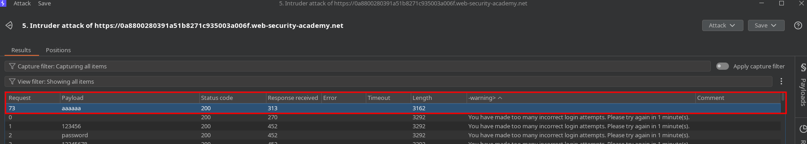
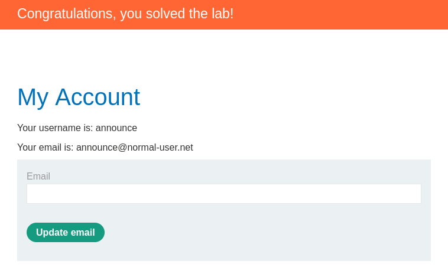

# PortSwigger Lab Writeup: Username enumeration via account lock

## Lab Details

- **Lab URL:** [Username enumeration via account lock](https://portswigger.net/web-security/learning-paths/authentication-vulnerabilities/password-based-vulnerabilities/authentication/password-based/lab-username-enumeration-via-account-lock)
- **Lab Category:** Authentication Vulnerabilities
- **Lab Title:** Username enumeration via account lock
- **Difficulty Level:** Practitioner
- **Lab Objective:** This lab is vulnerable to username enumeration. It uses account locking, but this contains a logic flaw. To solve the lab, enumerate a valid username, brute-force this user's password, then access their account page

## Executive Summary

One way in which websites try to prevent brute-forcing is to lock the account if certain suspicious criteria are met, usually a set number of failed login attempts. Just as with normal login errors, responses from the server indicating that an account is locked can also help an attacker to enumerate usernames

## Methodology

### 1. Reconnaissance

- Login page has account lock protection as successive incorrect attempts were locking the username
- The locking mechanism tells that username is correct, this flaw can be used for enumeration
- Application returned different response length for correct credentials
- Tools used: Burp Suite

### 2. Vulnerability Identification

- **Vulnerability Type:** Broken Authentication
- **Location:** Login page
- **Trigger:** Bypass the account ok restriction on login page with correct credentials

### 3. Exploitation

#### Step-by-Step Process:

1. With Burp running, investigate the login page and submit an invalid username and password. Send the POST /login request to Burp Intruder.

2. Select Cluster bomb attack from the attack type drop-down menu. Add a payload position to the username parameter. Add a blank payload position to the end of the request body by clicking Add §. The result should look something like this: username=§invalid-username§&password=example§§

3. In the Payloads side panel, add the list of usernames for the first payload position. For the second payload position, select the Null payloads type and choose the option to generate 5 payloads. This will effectively cause each username to be repeated 5 times. Start the attack.

4. In the results, notice that the responses for one of the usernames were longer than responses when using other usernames. Study the response more closely and notice that it contains a different error message: You have made too many incorrect login attempts. Make a note of this username.

 
5. Create a new Burp Intruder attack on the POST /login request, but this time select Sniper attack from the attack type drop-down menu. Set the username parameter to the username that you just identified and add a payload position to the password parameter.

 
6. Add the list of passwords to the payload set and create a grep extraction rule for the error message. Start the attack.

7. In the results, look at the grep extract column. Notice that there are a couple of different error messages, but one of the responses did not contain any error message. Make a note of this password.

8. Wait for a minute to allow the account lock to reset. Log in using the username and password that you identified and access the user account page to solve the lab.

### 4. Proof of Concept

