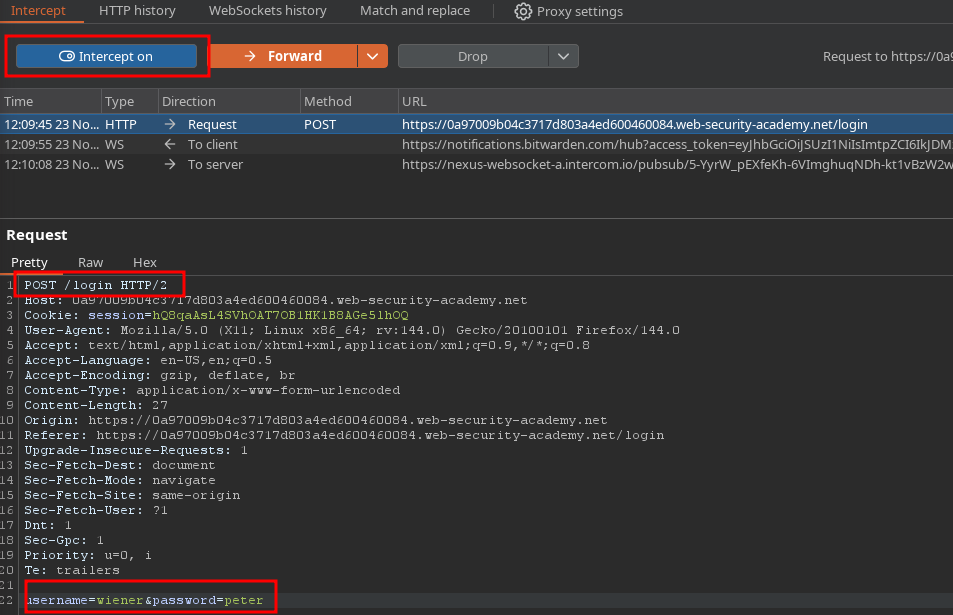
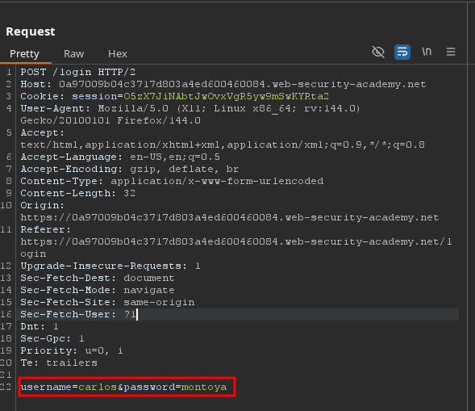
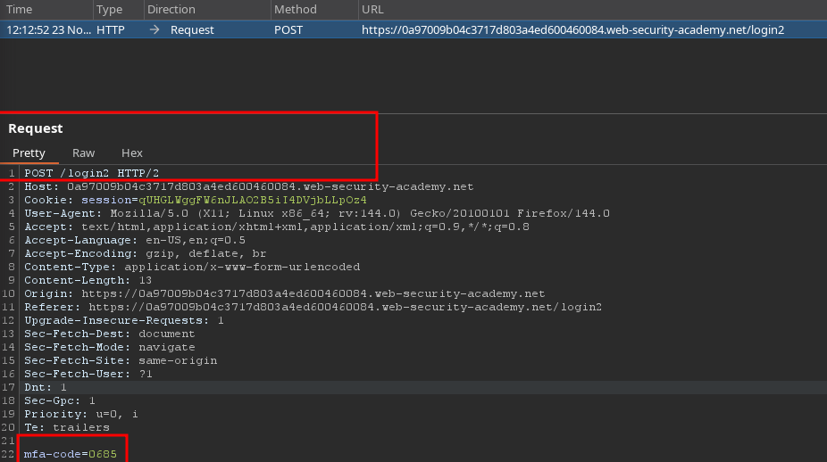
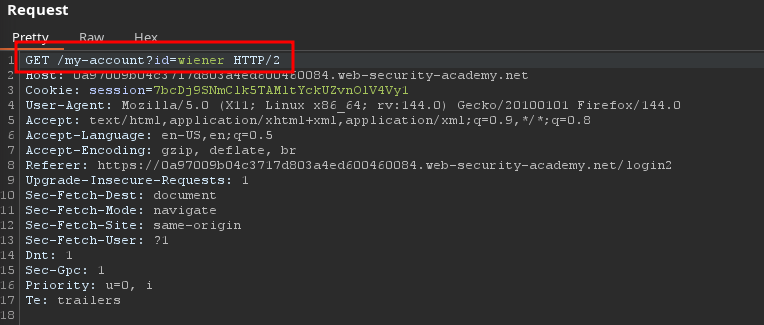
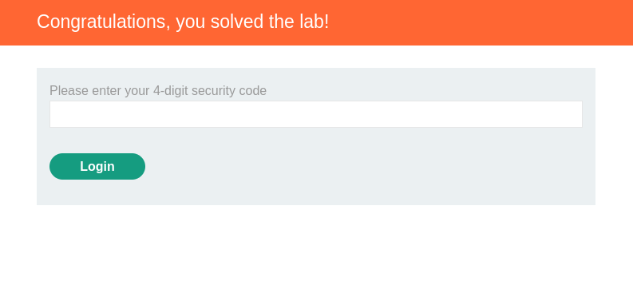

# PortSwigger Lab Writeup: 2FA simple bypass

## Lab Details

- **Lab URL:** [2FA simple bypass](https://portswigger.net/web-security/learning-paths/authentication-vulnerabilities/vulnerabilities-in-multi-factor-authentication/authentication/multi-factor/lab-2fa-simple-bypass)
- **Lab Category:** Authentication Vulnerabilities
- **Lab Title:** 2FA simple bypass
- **Difficulty Level:** Apprentice
- **Lab Objective:** This lab's two-factor authentication can be bypassed. You have already obtained a valid username and password, but do not have access to the user's 2FA verification code. To solve the lab, access Carlos's account page. 

## Executive Summary

The website was protected by 2FA, but on inspection of request it was found thet 2FA page is shown once the user is logged in and intermediate requests go to /my-account page, therefore to bypass 2FA all we have to do is intercept the request, modify the login2 request and redirect it it my-account page.

## Methodology

### 1. Reconnaissance

- Website was protected by 2FA
- 2FA code wa only shown once the user is logged in, hence a flaw that can be bypassdd
- Once logged in the user is redirected to login2 page
- Tools used: Burp Suite

### 2. Vulnerability Identification

- **Vulnerability Type:** Broken Authentication
- **Location:** Login page
- **Trigger:** Bypass the 2FA code restriction

### 3. Exploitation

#### Step-by-Step Process:

1. With Burp running, investigate the login page and submit a valid username and password. It was seen that 2FA was only presented once the user is logged in and it redirects to /login2 and then to /my-account  page therefore intercept the request

2. Change the username and password to the victim, the bypass is possible due to flaw as the code is generated after a correct login.

3. Forward the request and it will be redirected to /logn2, change the request to /my-account

4. Forward the request and the 2FA will be bypassed effectively accessing the victim account

### 4. Proof of Concept

